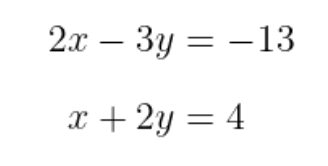
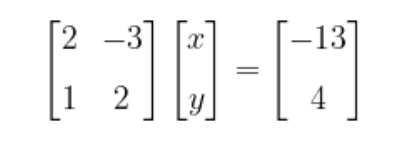

Bahan Ajar : Materi Matriks
Kelas : 6
Pengajar : Eris Taufiq H, ST, MT

Penggunaan Matriks
Ada beberapa cara untuk mencari solusi atau penyelesaian dari suatu sistem persamaan linear. Salah satu cara yang akan kita bahas di materi ini dikenal dengan Aturan Cramer atau Kaidah Cramer, diambil dari nama penemunya yakni Gabriel Cramer (1704–1752).

Aturan Cramer digunakan untuk menyelesaikan sistem persamaan linear dengan n persamaan dalam n variabel. Dasar metode ini adalah matriks dan determinan, sehingga kita perlu memahami kedua konsep tersebut terlebih dahulu untuk dapat menerapakan Aturan Cramer dalam mencari solusi suatu sistem persamaan linear.

Agar lebih jelas, kita akan menerapkan Aturan Cramer untuk menyelesaikan sistem persamaan linear dua variabel (SPLDV) dan sistem persamaan linear tiga variabel (SPLTV). Sekarang, perhatikanlah sistem persamaan linear dua variabel berikut.

Dengan menggunakan rumus aturan cramer, nilai x akan di peroleh seperti ini

!

Dan untuk nilai y akan di peroleh seperti ini

!

Contoh :

Selesaikan sistem persamaan linear dua variabel (SPLDV) berikut dengan menggunakan Aturan Cramer.
!!

!

Pembahasan:

SPLDV dalam soal di atas dapat dinyatakan dalam bentuk matriks, yakni
!

#

Berdasarkan Aturan Cramer, kita peroleh hasil berikut.
!

Jadi, nilai x dan y yang memenuhi SPLDV di atas yaitu
x = −2 dan y = 3
.

Praktek :
1.Buatlah program menghitung determinan memakai wxdev dengan GUI.
2.Buat project baru
3.File->New->Project
4.pilih wxWidgetFrame dengan nama Determinant
5.Save di directory D:\kelas6_project\determinant

6.Selanjutnya create

7.Selanjutnya Buat Form seperti dibawah ini

8.Selanjutnya Rubah Form Menjadi seperti ini

9.Selanjutnya Compile dan Run Without Debugging (pastikan file exe terbentuk)
